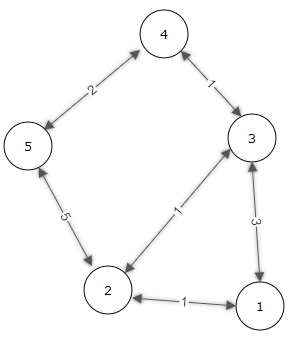

# Sneaking Out
Sample program to parse a graph and generate shortest paths.

## Problem Description
I packed my bags and went down to the docks. After weeks of planning, I was ready to steal a boat and escape. I had pondered my escape options. The Forest Kingdom was and is still likely to fall, and the Carmouche Wildlife Preserve was way too far away. Aruba it was then. May I could tube the mythical Aruban beaches or even ride the dolphins.

Before my vacation, I will need to hijack a Stroudonian military ship and override the systems. While the dock is insecure, there are a number of guards stationed throughout the area, and if one of them notices me, I will probably be acught and killed. I have mapped out the dock, noting the positions that guards are stationed.

In my map, there are certain safe zones, where I can hide without worry of a guard noticing me. I have also identified pathways between nearby safe zones and the time it takes to sneak through each pathway without alerting the guards. I would like to determine the shortest amount of time it will take me to sneak out to the boat, assuming that it takes me no time to go through a safe zone. Ideally, I want to hit the sea as soon as possible, and escape from Stroudonia.

## Input Description
The first line contains t, an integer dictating the number of test cases to follow, Each test case consists of the following:

The first line contains two integers, **n** and **m** (2 ≤ n, m ≤ 1,000,000), indicating the number of safe zones (including my starting location and the location of the boat) and the number of pathways between safe zones, respectively. All safe zones are numbered, the starting location always being zone number 1, and the location of the boat is zone number **n**. The following **m** lines contain three integers, **u**, **v**, and **w** (1 ≤ u, v ≤ n, 1 ≤ w ≤ 1,000,000,000, u ≠ v). The integers **u** and **v** represent the numbers of safe zones that are connected by a pathway (pathways can be crossed in either direction), while the integer **w** represents the time it takes to sneak through.

## Output Description
Each line should contain the minimum amount of time it takes to sneak out to the boat for the given data set.


### Sample Input
```
2
5 6
1 2 1
1 3 3
2 3 1
2 5 5
3 4 1
4 5 2
7 7
1 4 2
2 3 1
3 6 4
2 7 2
3 5 2
4 5 1
7 5 6
```
### Sample Output
```
5
8
```
### Sample Input Visualization (1st Case)

